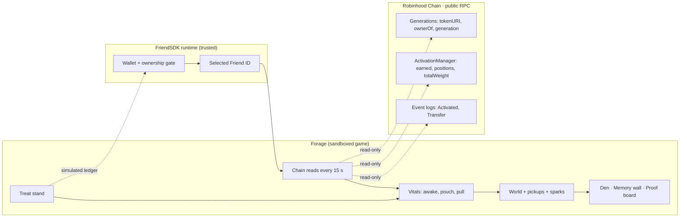

<div align="center">


&nbsp;

[](LICENSE)

-111)


### Your Rare Friend gathers only what it really earned, in the world written into its own token.

Most Friend games ask what your Friend can *do*. Forage shows what your Friend *is*: its world, its earnings and its history, read live from **Rare Friends on Robinhood Chain**. Nothing is invented.

**[ Play it ↗ ](https://cassxbt.github.io/rarefriends-forage/)** · **[ Judge it in 90 seconds ↓ ](#judge-it-in-90-seconds)** · **[ Proof on mainnet ↓ ](#proof-on-mainnet)** · **[ What's real ↓ ](#whats-real-and-whats-simulated)**

</div>

> **To play:** a browser wallet on Robinhood mainnet holding a hardwired Generations Friend (generation ≥ 1). No RF, no signature, no transaction.

## Contents

- [The problem I set out to solve](#the-problem-i-set-out-to-solve)
- [What I built](#what-i-built)
- [Judge it in 90 seconds](#judge-it-in-90-seconds)
- [Proof on mainnet](#proof-on-mainnet)
- [How it works](#how-it-works)
- [Why it can't exist without Rare Friends](#why-it-cant-exist-without-rare-friends)
- [When things go wrong](#when-things-go-wrong)
- [The Treat stand: RF economy](#the-treat-stand-rf-economy)
- [Engineering decisions](#engineering-decisions)
- [What's real and what's simulated](#whats-real-and-whats-simulated)
- [Run it, test it](#run-it-test-it)

## The problem I set out to solve

A Rare Friend is not a picture. It has its own wallet, it earns RF and WETH every second, it was born in a specific world, and its life is written on-chain: when it appeared, when it was hardwired, who has owned it.

Yet a game in the FriendSDK sandbox forgets everything on reload, and most Friend games treat the NFT as a skin: a sprite dropped into someone else's world, playing for numbers the game made up.

I wanted the opposite: **a game where the Friend's real on-chain life *is* the level.** Its world, its food and its memories come from the chain, and the game refuses to show anything the chain doesn't back.

## What I built

**Earned Ground: it can't carry what it hasn't earned.**

1. **Read** the selected Friend: its Scenery trait, reward position and unclaimed rewards, plus its history from event logs.
2. **Place** it in *its own* world. The token's Scenery trait picks one of the six Rare Friends worlds.
3. **Gather** its real unclaimed rewards, laid out as glowing pickups. Kept treats give it a magnet pull.
4. **Grow** the ground only from real earnings: each chain read that shows new rewards adds a spark worth exactly that increase. Every few sparks, the earnings are held back and arrive as one **golden spark** on a timer; missed, it scatters into sparks worth exactly the same.
5. **Bring home** to the Den, where the trip lands on a **Memory wall** beside the Friend's real milestones and their transaction hashes.
6. **Prove** every number on the Proof board: contract, function and block.

| | |
|---|---|
|  |  |
| **Memory wall.** Real lifecycle events with explorer links, then this session's trips, labelled as session-only. | **Proof board.** Each live value, the contract call behind it and the block it was read at. |

## Judge it in 90 seconds

1. **Open** [the preview](https://cassxbt.github.io/rarefriends-forage/), connect, pick your Friend. The top-left card names **its on-chain scenery**; the world matches it.
2. **Look at the pouch card.** That is your Friend's real unclaimed RF, ticking between 15-second chain reads. Compare it with "Claimable" on [rarefriends.com/portfolio](https://rarefriends.com/portfolio).
3. **Walk into pickups** (WASD, arrows or tap). They stack above your Friend's head.
4. **Walk to the Den** and press E: bring them home, then read the **Memory wall**. Copy a tx hash into the explorer.
5. **Wait about 15 s.** A white spark appears, but only if the chain says your Friend earned more.
6. **Open the Proof board.** Every value names its contract call and block.
7. **The refusal:** a Friend that isn't earning **rests** and can't gather, and the Den tells you why and what reactivation costs. Pull the network and the pouch **freezes** at its last read instead of guessing.

## Proof on mainnet

Friend **#93858** (Generation 3, Mask), used for the screenshots above and the live test:

| Fact | Value | Where it comes from |
|---|---|---|
| World | Scenery **Rooftop** → Rooftop Hangout | `Generations.tokenURI(93858)` |
| Appeared | block 67,765,091 · 2026-09-20 07:36 UTC | [tx 0x9044d0a5…](https://robinhoodchain.blockscout.com/tx/0x9044d0a5febc01d674325d31f15a7b9cbbd087734778a55ecc8c3304438cd860) |
| Hardwired and earning | block 67,767,619 · weight 1,450 · paid 1,000 RF | [tx 0xf52fc13b…](https://robinhoodchain.blockscout.com/tx/0xf52fc13b2c2220841c5bce21ce3089f576d4684b14bf75ce4d07ec59fe660649) |
| Unclaimed rewards | ~114 RF at the time of the screenshots, growing every second | `ActivationManager.earned(RF, Generations, 93858)` |

Re-run it yourself:

```sh
npm ci && npm run test:live   # reads #93858's state, world and history from Robinhood mainnet
```

Contracts read (all read-only): Generations [`0x14C4…181D`](https://robinhoodchain.blockscout.com/address/0x14C49e6118F46525dE9ab41a51cBAA3c6EBF181D) · ActivationManager [`0xD4A3…83Ac`](https://robinhoodchain.blockscout.com/address/0xD4A35e11318E3679168d409184B788bcF9F283Ac) · RF [`0x0779…B71f`](https://robinhoodchain.blockscout.com/address/0x0779369854d3EcdEA927206718FFD7730C67B71f).

## How it works



The SDK runtime owns the wallet and verifies ownership. The game only receives the Friend's ID, then reads the chain directly. The sandbox allows exactly one host: the public Robinhood RPC. Nothing in the game can sign.

| File | Job |
|---|---|
| [`game/index.tsx`](game/index.tsx) | The game: world, pickups, stations, HUD |
| [`game/friend-chain.ts`](game/friend-chain.ts) | Every chain read, plus history paged under the RPC's 10M-block limit |
| [`game/vitals.ts`](game/vitals.ts) | Pure rules: awake/resting, sparks, claims, pull, milestones |
| [`game/world.ts`](game/world.ts) | The Friend's world, reachable ground and station layout |
| [`game/game.json`](game/game.json) | Treat odds and values, in RF base units |

## Why it can't exist without Rare Friends

Remove the Rare Friends contracts and every screen empties:

| On screen | Needs |
|---|---|
| The world | the Friend's Scenery trait (`tokenURI`) |
| The character | its canonical on-chain sprite, behind the SDK ownership gate |
| Every pickup and spark | its real rewards (`earned`) |
| Awake or resting | its reward weight (`positions`) |
| The Memory wall | its own `Activated` and `Transfer` events |
| The magnet | treats bought with RF |

## When things go wrong

Forage shows the refusal, not only the happy path. Each case is covered by an automated test.

| Situation | What Forage does | Tested in |
|---|---|---|
| Friend isn't earning (activation cleared) | Rests: no pickups; the Den explains and shows the reactivation cost | `test/browser.test.mjs` |
| RPC unreachable | Says "Can't see your Friend's chain state"; the pouch freezes at the last read | `test/browser.test.mjs` |
| A slow read arrives after a newer one | Ignored; it can't wipe the ground or fake a claim | `test/browser.test.mjs` |
| Rewards claimed on rarefriends.com | Detects the drop, clears the ground and says so | `test/browser.test.mjs` |
| Golden spark missed | Scatters into three sparks worth exactly the same | `test/browser.test.mjs`, `game/vitals.test.ts` |
| Friend changed owners, even A → B → A | Memory wall walks history backwards without repeats | `test/browser.test.mjs` |
| World metadata can't be read | Loads the default world and says so on the HUD | `game/world.test.ts` (fallback world builds) |
| Bringing pickups home away from the Den | Refused: "Walk your Friend to the Den" | `test/browser.test.mjs` |

## The Treat stand: RF economy

**Simulated, as the Vibeathon requires.** A treat costs **1 RF** and cracks into a snack. Keep the snack and your Friend's **pull** grows, so pickups glide to it from farther away. Redeem it for fixed RF and the pull goes with it. Every reveal is a choice: *the RF, or the magnet?*

| Snack | Chance | Redeems for | Pull while kept |
|---|---:|---:|---:|
| Crumb | 40% | 0.25 RF | +6 |
| Berry | 30% | 0.75 RF | +12 |
| Honeycomb | 20% | 1.5 RF | +20 |
| Stardrop | 10% | 2.5 RF | +40 |

Expected value **0.875 RF** per treat (12.5% edge). Base pull 20, up to +60 from treats. Backing follows the SDK unchanged: each treat reserves its 2.5 RF maximum, kept snacks stay backed, no expiry. **Going live needs no new contract:** the SDK's `ChanceGame` with this `game.json` (`buy` → `play` → `settle` → `redeem`), and the pull reads the Friend wallet's snack balances. Randomness is the SDK ledger in preview and Dice commit-reveal live.

## Engineering decisions

- **Never invent a number.** The pouch projects between reads only while the last read is fresh; after a failed read it freezes and says so. A read older than the one on screen is dropped.
- **A spark is exactly one real increase.** No fixed spark size, so a slow earner still sees sparks and none are made up. A missed golden spark splits into parts that add back to the same value.
- **History comes from events, not old state.** The public RPC keeps only recent state and rejects log queries over 10M blocks or filtered by token alone. So `Activated` is read by token, and `Transfer` by walking owners backwards, strictly earlier each step.
- **The world is laid out, not guessed.** One flood fill finds every reachable spot (12–107 ms, down from up to 4.6 s with per-point routing). Stations are placed so their labels never overlap, stay below the HUD and never cover the Friend where it appears, and their props draw behind it wherever the world has room (all but the tiny Orbital world). Tested in all six worlds.

## What's real and what's simulated

| Capability | Status |
|---|---|
| Wallet connection and ownership gate | **Real.** FriendSDK runtime, fresh on-chain eligibility check |
| The Friend's world, sprite, generation, tier, weight | **Real.** Read from Robinhood mainnet |
| Unclaimed rewards (pouch, pickups, sparks) | **Real values, read-only.** Pickups are a picture of them: gathering moves nothing, claiming stays on rarefriends.com |
| Memory wall milestones | **Real.** The Friend's own `Activated` and `Transfer` events |
| Trips home | **Session only.** The sandbox has no storage; the wall labels them |
| Treats, snacks, redemption, pull | **Simulated** with the SDK ledger, clearly labelled in game |
| Live contract deployment | **Not built (never faked).** The path is the SDK's `ChanceGame`, above |

Known limits: trips and treats reset on reload; the SDK's stock `friendsdk test` harness mocks only SDK calls, so [`test/browser.test.mjs`](test/browser.test.mjs) adds Forage's reads on top of the same fixture; a Friend with more than four owners shows its latest four moves; tested on desktop Chrome.

## Run it, test it

Node.js 22.18+:

```sh
git clone https://github.com/Cassxbt/rarefriends-forage.git
cd rarefriends-forage
npm ci
npm run dev             # http://127.0.0.1:4173
```

| Command | Checks |
|---|---|
| `npm test` | 26 unit and world tests: vitals, sparks, claims, pull, and all six worlds |
| `npm run test:browser` | 4 end-to-end runs of the real SDK runtime in headless Chromium, with the chain mocked |
| `npm run test:live` | #93858's real state, world and history on mainnet |
| `npm run typecheck` · `npm run check` | TypeScript, and FriendSDK game validation |

Also played by hand with a real wallet and Friend #93858: gate, world, gathering, sparks, a Den trip, the Memory wall, the Proof board, and a Honeycomb raising the pull from 20 to 40.

---

<div align="center">

Built for the **[Rare Friends Vibeathon](https://rarefriends.com/vibeathon)** · **Character Spotlight** · by [@Cassxbt](https://github.com/Cassxbt)

FriendSDK 0.1.3 (Apache-2.0) supplies the runtime, worlds, sprites and sounds ([NOTICE](NOTICE.md)). Forage's code is [MIT](LICENSE).

</div>
