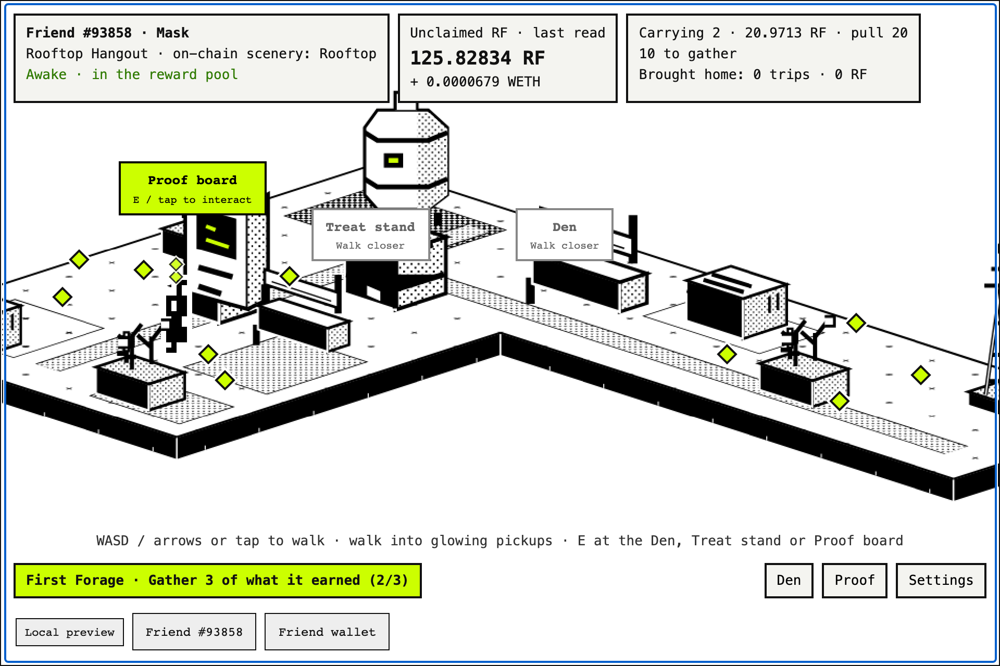
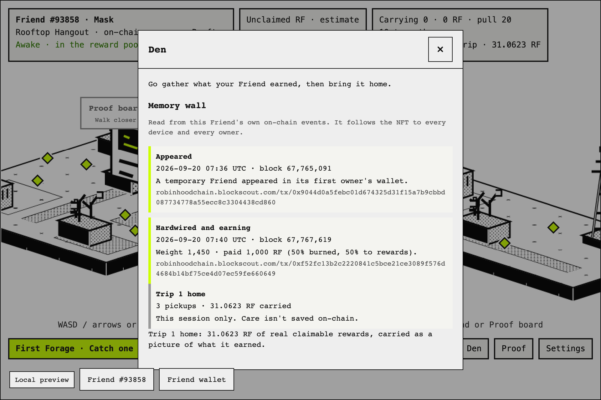
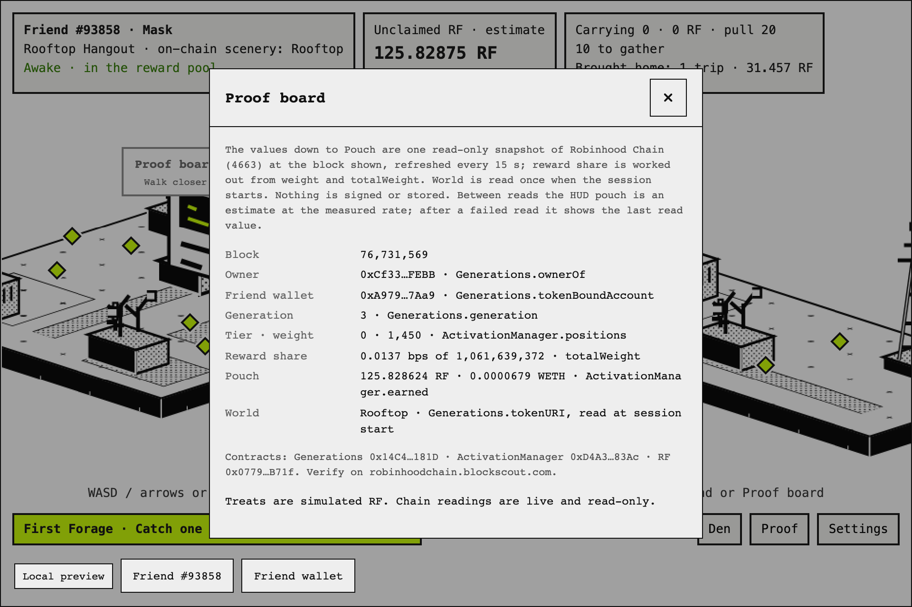
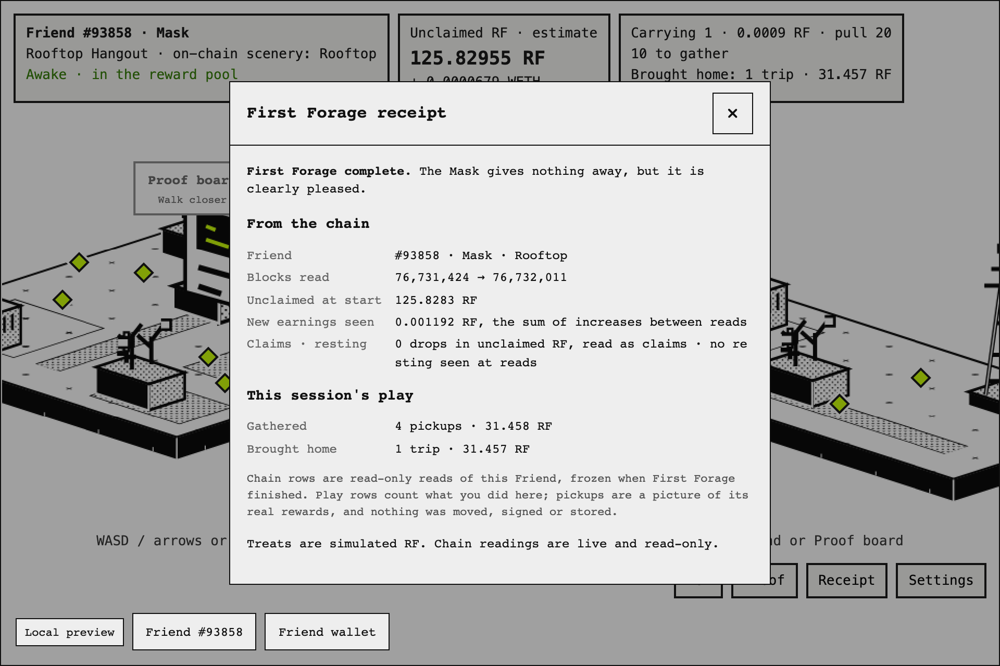
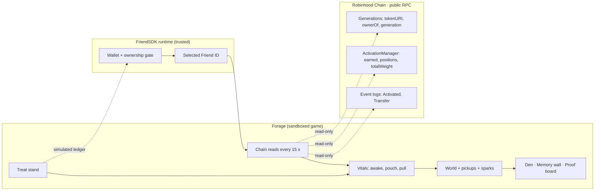

<div align="center">



&nbsp;

[](LICENSE)

-111)


### Your Rare Friend gathers only what it really earned, in the world written into its own token.

Most Friend games ask what your Friend can *do*. Forage shows what your Friend *is*: its world, its earnings and its history, read live from **Rare Friends on Robinhood Chain**. No reward is invented.

**[ Play it ↗ ](https://rarefriends-forage.vercel.app)** · **[ Judge it in 90 seconds ↓ ](#judge-it-in-90-seconds)** · **[ Proof on mainnet ↓ ](#proof-on-mainnet)** · **[ What's real ↓ ](#whats-real-and-whats-simulated)**

</div>

> **To play:** a browser wallet on Robinhood mainnet holding a hardwired Generations Friend (generation ≥ 1). No RF funding, signature or transaction is needed: treats use the SDK's simulated ledger.

## Contents

- [The problem I set out to solve](#the-problem-i-set-out-to-solve)
- [What I built](#what-i-built)
- [First Forage: the first minute](#first-forage-the-first-minute)
- [Judge it in 90 seconds](#judge-it-in-90-seconds)
- [Proof on mainnet](#proof-on-mainnet)
- [How it works](#how-it-works)
- [Why it can't exist without Rare Friends](#why-it-cant-exist-without-rare-friends)
- [When things go wrong](#when-things-go-wrong)
- [The Treat stand: RF economy](#the-treat-stand-rf-economy)
- [Engineering decisions](#engineering-decisions)
- [What's real and what's simulated](#whats-real-and-whats-simulated)
- [Run it, test it](#run-it-test-it)

## The problem I set out to solve

A Rare Friend is not a picture. It has its own wallet, it earns RF and WETH every second, it was born in a specific world, and its life is written on-chain: when it appeared, when it was hardwired, who has owned it.

Yet a game in the FriendSDK sandbox forgets everything on reload, and most Friend games treat the NFT as a skin: a sprite dropped into someone else's world, playing for numbers the game made up.

I wanted the opposite: **a game where the Friend's real on-chain life *is* the level.** Its world, its rewards and its memories come from the chain. The layout, the treats and the trips are game design, and the game labels them as such; what it never does is show a reward the chain doesn't back.

## What I built

**Earned Ground: it can't carry what it hasn't earned.**

1. **Read** the selected Friend: its Scenery trait, reward position and unclaimed rewards, plus its history from event logs.
2. **Place** it in *its own* world. The token's Scenery trait picks one of the six Rare Friends worlds.
3. **Gather** its real unclaimed RF, laid out as glowing pickups (WETH is shown, not gathered). Kept treats give it a magnet pull.
4. **Grow** the ground only from real earnings growth between chain reads: new earnings arrive as white sparks. Now and then they are held back and arrive together as one **golden spark** with 12 seconds of play to catch it (the timer pauses in menus); the first comes about a minute in if the Friend keeps earning. Missed, it scatters into three sparks worth exactly the same.
5. **Bring home** to the Den, where the trip lands on a **Memory wall** beside the Friend's real milestones and their transaction hashes.
6. **Prove** the numbers on the Proof board: the financial rows are one snapshot, each with its contract call and the block.

| | |
|---|---|
|  |  |
| **Memory wall.** Real lifecycle events with copyable explorer URLs, then this session's trips, labelled as session-only. | **Proof board.** Each live value, the contract call behind it and the block of the snapshot it came from. |

## First Forage: the first minute

Every session opens with a short journey, shown in the objective bar:

1. **Gather what it earned**: 3 pickups, or fewer if fewer are on the ground.
2. **Bring them home to the Den.**
3. **Catch one fresh spark**: a pickup that appeared after the trip, from real new earnings.

Finish it and your Friend reacts in its own family's voice (a Mask gives nothing away, a Colossus shakes the ground), and a **receipt** opens. It is frozen at that moment, reopens from the Receipt button, and keeps two things apart: what the chain showed (the blocks read, unclaimed RF at the start, every increase between reads, drops read as claims, resting seen at a read) and this session's play (what you gathered and brought home).

A Friend with nothing waiting, or one whose rewards were just claimed, waits for its next real earnings and gathers those; a claim mid-journey restarts gathering, because it cleared the ground. A resting Friend is told why the journey can't run. Nothing is faked to complete it.



## Judge it in 90 seconds

1. **Open** [the preview](https://rarefriends-forage.vercel.app), connect, pick your Friend. The top-left card names **its on-chain scenery**; the world matches it.
2. **Look at the pouch card.** That is your Friend's real unclaimed RF from the last chain read, estimated between 15-second reads. Compare it with "Claimable" on [rarefriends.com/portfolio](https://rarefriends.com/portfolio).
3. **Follow First Forage** in the objective bar: walk into pickups (WASD, arrows or tap); they stack above your Friend's head.
4. **Walk to the Den** and press E: bring them home, then read the **Memory wall**. Copy a tx hash into the explorer.
5. **Catch a fresh spark.** It appears only after a chain read shows your Friend earned more (sometimes held back as a golden one). Catch it to finish First Forage and see its reaction and receipt.
6. **Open the Proof board.** Each financial row names its contract call; together they are one snapshot at the block shown.
7. **The refusal:** a Friend out of the reward pool **rests**: its pickups dim and can't be gathered, and the Den says why and what reactivation costs. Pull the network and the pouch **stops** at its last read value instead of guessing.

## Proof on mainnet

Friend **#93858** (Generation 3, Mask), used for the screenshots above and the live test:

| Fact | Value | Where it comes from |
|---|---|---|
| World | Scenery **Rooftop** → Rooftop Hangout | `Generations.tokenURI(93858)` |
| Appeared | block 67,765,091 · 2026-09-20 07:36 UTC | [tx 0x9044d0a5…](https://robinhoodchain.blockscout.com/tx/0x9044d0a5febc01d674325d31f15a7b9cbbd087734778a55ecc8c3304438cd860) |
| Hardwired and earning | block 67,767,619 · weight 1,450 · paid 1,000 RF | [tx 0xf52fc13b…](https://robinhoodchain.blockscout.com/tx/0xf52fc13b2c2220841c5bce21ce3089f576d4684b14bf75ce4d07ec59fe660649) |
| Unclaimed rewards | ~124 RF at the time of the screenshots, growing every second | `ActivationManager.earned(RF, Generations, 93858)` |

Re-run it yourself:

```sh
npm ci && npm run test:live   # reads #93858's state, world and history from Robinhood mainnet
```

Contracts read (all read-only): Generations [`0x14C4…181D`](https://robinhoodchain.blockscout.com/address/0x14C49e6118F46525dE9ab41a51cBAA3c6EBF181D) · ActivationManager [`0xD4A3…83Ac`](https://robinhoodchain.blockscout.com/address/0xD4A35e11318E3679168d409184B788bcF9F283Ac) · RF [`0x0779…B71f`](https://robinhoodchain.blockscout.com/address/0x0779369854d3EcdEA927206718FFD7730C67B71f).

## How it works



The SDK runtime owns the wallet and verifies ownership. The game only receives the Friend's ID, then reads the chain directly: the financial state as one snapshot pinned to a block every 15 s, the world metadata once per session, and history from event logs. The sandbox lets the game reach one outside host, the public Robinhood RPC. Nothing in the game can sign.

| File | Job |
|---|---|
| [`game/index.tsx`](game/index.tsx) | The game: world, pickups, stations, HUD |
| [`game/friend-chain.ts`](game/friend-chain.ts) | Every chain read, plus history paged under the RPC's 10M-block limit |
| [`game/vitals.ts`](game/vitals.ts) | Pure rules: awake/resting, sparks, claims, pull, milestones |
| [`game/world.ts`](game/world.ts) | The Friend's world, reachable ground and station layout |
| [`game/game.json`](game/game.json) | Treat odds and values, in RF base units |

## Why it can't exist without Rare Friends

Remove the Rare Friends contracts and none of these can exist:

| On screen | Needs |
|---|---|
| The world | the Friend's Scenery trait (`tokenURI`) |
| The character | its canonical on-chain sprite, behind the SDK ownership gate |
| Every pickup and spark | its real rewards (`earned`) |
| Awake or resting | its reward weight (`positions`) |
| The Memory wall | its own `Activated` and `Transfer` events |
| The magnet | treats bought with RF |

## When things go wrong

Forage shows the refusal, not only the happy path. Each case is covered by an automated test.

| Situation | What Forage does | Tested in |
|---|---|---|
| Friend leaves the reward pool mid-session | Pickups dim and can't be gathered; the Den explains and shows the reactivation cost | `test/browser.test.mjs` (awake → resting) |
| Friend starts resting, then rejoins | Its waiting rewards are laid out once it's active again | `test/browser.test.mjs` (resting → awake) |
| Rewards claimed on rarefriends.com, even while carrying | The ground **and** what it carries are cleared, the game says so, and First Forage restarts gathering from the next earnings | `test/browser.test.mjs`, `game/vitals.test.ts` |
| RPC unreachable | "Can't see your Friend's chain state"; the pouch stops at its last read value | `test/browser.test.mjs` |
| A delayed read | Can't wipe the ground or fake a claim; a read older than the one on screen is dropped by block number | `test/browser.test.mjs` (delayed read), `game/index.tsx` |
| Golden spark missed | Scatters into three sparks worth exactly the same | `test/browser.test.mjs`, `game/vitals.test.ts` |
| Ownership moves, even A → B → A, or twice in one block | The wall walks back in chain order (block, then log position), up to four moves, and says when it stops early | `test/browser.test.mjs`, `game/vitals.test.ts` |
| World metadata can't be read | Loads the default world and says so on the HUD | `game/world.test.ts` (fallback world builds) |
| Bringing pickups home away from the Den | Refused: "Walk your Friend to the Den" | `test/browser.test.mjs` |

## The Treat stand: RF economy

**Simulated, as the Vibeathon recommends for an MVP.** A treat costs **1 RF** and cracks into a snack. Keep the snack and your Friend's **pull** grows, so pickups glide to it from farther away. Redeem it for fixed RF and the pull goes with it. Every reveal is a choice: *the RF, or the magnet?*

| Snack | Chance | Redeems for | Pull while kept |
|---|---:|---:|---:|
| Crumb | 40% | 0.25 RF | +6 |
| Berry | 30% | 0.75 RF | +12 |
| Honeycomb | 20% | 1.5 RF | +20 |
| Stardrop | 10% | 2.5 RF | +40 |

Expected value **0.875 RF** per treat (12.5% edge). Base pull 20, up to +60 from treats. Backing follows the SDK unchanged: each treat reserves its 2.5 RF maximum, kept snacks stay backed, no expiry. **No custom contract is proposed:** going live would use the SDK's `ChanceGame` with this `game.json` (`buy` → `play` → `settle` → `redeem`), with the pull reading the Friend wallet's snack balances. Deploying, funding and verifying it is still to do. Randomness is the SDK ledger in preview and Dice commit-reveal live.

## Engineering decisions

- **Never show more than the chain backs.** One rule reconciles the game with each read: everything it represents (ground, carried and brought home since the last claim) may never exceed the Friend's real unclaimed RF. Less means a claim; more means new ground. Between reads the pouch is an estimate at the measured rate, labelled as one; after a failed read it shows the last read value.
- **A spark is exactly one real increase.** No fixed spark size, so a slow earner still sees sparks and none are made up. A missed golden spark splits into parts that add back to the same value.
- **History comes from events, not old state.** The public RPC keeps only recent state and rejects log queries over 10M blocks or filtered by token alone. So `Activated` is read by token, and `Transfer` by walking owners backwards in chain order (block, then log position), so two moves in one block both survive.
- **The world is laid out, not guessed.** One flood fill finds every reachable spot, replacing slow per-point routing. Stations are placed so their labels never overlap, stay below the HUD and never cover the Friend where it appears, and their props draw behind it wherever the world has room (all but the tiny Orbital world). Tested in all six worlds.

## What's real and what's simulated

| Capability | Status |
|---|---|
| Wallet connection and ownership gate | **Real.** FriendSDK runtime, fresh on-chain eligibility check |
| The Friend's Scenery trait, sprite, generation, tier, weight | **Real.** Read from Robinhood mainnet. The trait picks one of six SDK worlds; Forage lays out the stations and pickups |
| Unclaimed rewards (pouch, pickups, sparks) | **Real RF values, read-only**, estimated between reads and labelled. Pickups are a picture of them: gathering moves nothing, claiming stays on rarefriends.com. WETH is shown, not gathered |
| Memory wall milestones | **Real.** The Friend's own `Activated` and `Transfer` events |
| Trips home, First Forage receipt | **Session only.** The receipt separates chain reads from play counts; the sandbox has no storage, so both reset on reload |
| Treats, snacks, redemption, pull | **Simulated** with the SDK ledger, clearly labelled in game |
| Live contract deployment | **Not built (never faked).** The path is the SDK's `ChanceGame`, above |

Known limits: trips, treats and the receipt reset on reload; the SDK's stock `friendsdk test` harness mocks only SDK calls, so [`test/browser.test.mjs`](test/browser.test.mjs) adds Forage's reads on top of the same fixture; the wall shows the latest four ownership moves; `npm run test:live` checks #93858's exact history, so it needs updating if that Friend changes hands; tested on desktop Chrome.

## Run it, test it

Node.js 22.18+:

```sh
git clone https://github.com/Cassxbt/rarefriends-forage.git
cd rarefriends-forage
npm ci
npm run dev             # http://127.0.0.1:4173
```

| Command | Checks |
|---|---|
| `npm test` | 37 unit and world tests: the reconcile rule, sparks, claims, pull, history order, every First Forage stage change, and all six worlds |
| `npm run test:browser` | 9 end-to-end runs of the real SDK runtime in headless Chromium with the chain mocked: claims, resting and waking transitions, a delayed read, an outage, ownership history, the golden spark, a Den trip, treat keep and redeem, First Forage with an exact receipt, and a claim mid-journey. First run `npx playwright install chromium` |
| `npm run test:live` | #93858's real state, world and history on mainnet |
| `npm run typecheck` · `npm run check` | TypeScript, and FriendSDK game validation |

CI runs all of these except `test:live` on every push.

Also played by hand with a real wallet and Friend #93858 (before First Forage was added): gate, world, gathering, sparks, a Den trip, the Memory wall, the Proof board, and a Honeycomb raising the pull from 20 to 40.

---

<div align="center">

Built for the **[Rare Friends Vibeathon](https://rarefriends.com/vibeathon)** · **Character Spotlight** · by [@Cassxbt](https://github.com/Cassxbt)

FriendSDK 0.1.4 (Apache-2.0) supplies the runtime, worlds, sprites and sounds ([NOTICE](NOTICE.md)). Forage's code is [MIT](LICENSE).

</div>
